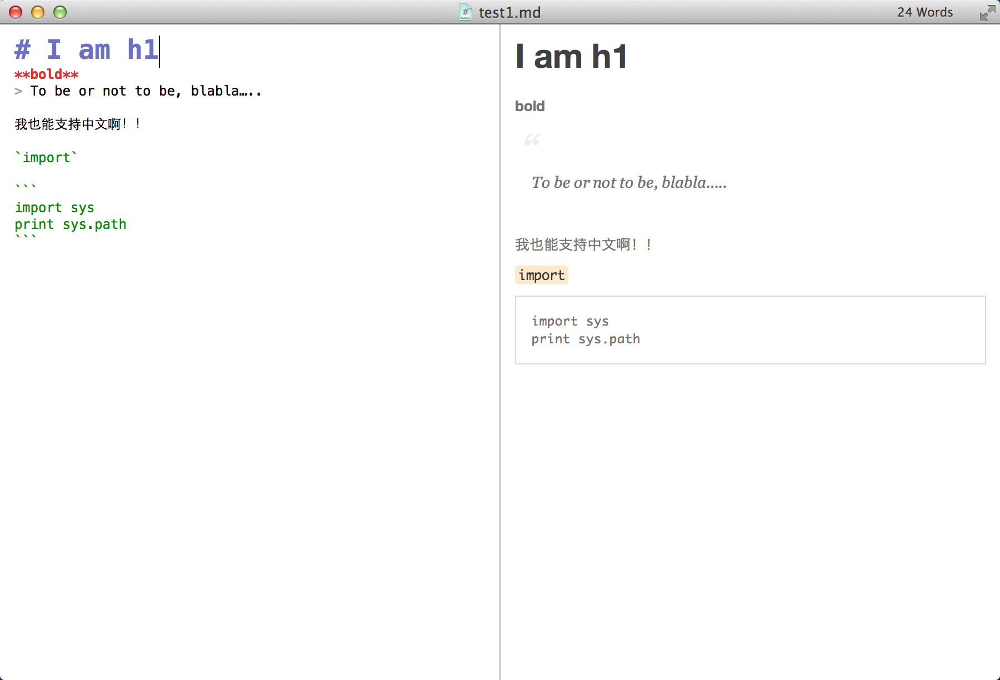
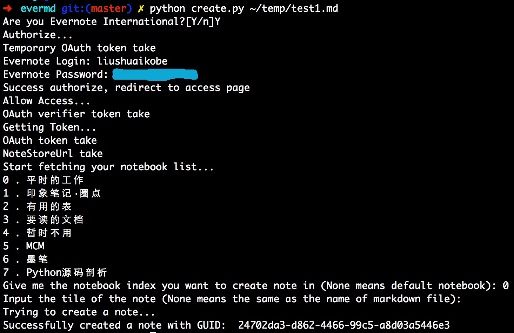
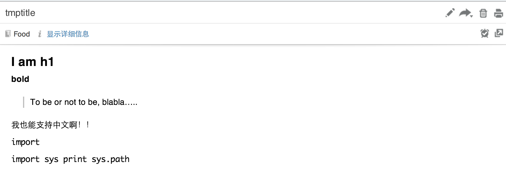

evermd
======
## What is evermd ?
evermd is a command line tool implemented with Python 2.X that provides a simple markdown support to [Evernote](http://www.evernote.com/).        
Because of its using the [Markdown](https://pypi.python.org/pypi/Markdown) lib of Python, there are something that evermd **doesn't** support:

- LaTeX expression
- code blocks specified language
- Table

Some evermd supports is as follows:

- title from h1 to h6
- italic and bold
- hyperlink
- unordered list and ordered list
- quote
- image insert
- code and code blocks without specific language
- …

Hope some Geeks and Evernote fans can be involved to make evermd more and more powerful.
## How to use ?
### Requirements
There are some libraries required:

- [httplib](http://docs.python.org/2/library/httplib.html)
- [oauth2](https://github.com/simplegeo/python-oauth2)
- [Markdown](https://pypi.python.org/pypi/Markdown)

You can get them installed via `pip` or `easy_install` or some other way. For details, please read specific documentions.  
### Download       
```
# Download the repository.
$ git clone git@github.com:liushuaikobe/evermd.git
```
### Installation
Evermd doesn't need any extra installations. Yout just need to excute the specific Python scripts included in this repo to use it.
### Use
1. Edit your note wrriten on markdown with any editor you like, [Mou](http://mouapp.com/) is a good choice in OS X.

2. Save your note as a markdown file. I save it in `~/temp/test1.md`.
3. Excute the scripts. 

```
$ cd evermd

$ python create.py ~/temp/test1.md 
# you will be prompted for your evernote login and pwd
```
The entire process may be:

4. Enjoy evermd ! 


## Defects
There are some inevitable defects in evermd. you can read the code and propose some issues. I appreciate it when pull requests received.    
Some known defects:

- we can just create a note but we can't modify it or even sync it
- markdown -> html -> [ENML](http://dev.evernote.com/start/core/enml.php), in which `html -> ENML` process need to be improved
- the way we get the default note name need to be handled more robust

## Thanks to
- [geeknote](https://github.com/VitaliyRodnenko/geeknote)
- [python-oauth2](https://github.com/simplegeo/python-oauth2)


## LICENSE
GNU GENERAL PUBLIC LICENSE
